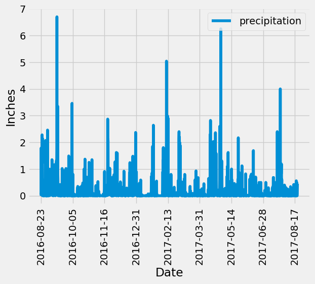
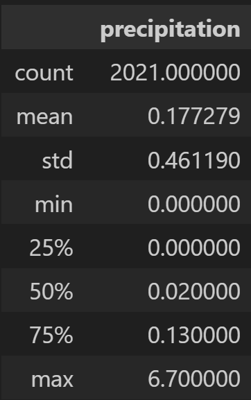
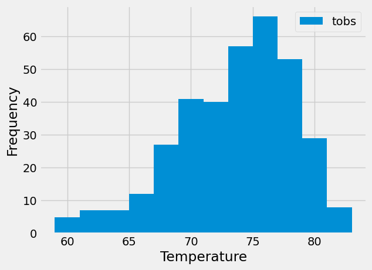

# sqlalchemy-challenge

I am Andrea Ceriati, and this week I worked on the following assignment:

# Instructions

Congratulations! You've decided to treat yourself to a long holiday vacation in Honolulu, Hawaii. To help with your trip planning, you decide to do a climate analysis about the area. The following sections outline the steps that you need to take to accomplish this task.

## Part 1: Analyze and Explore the Climate Data

In this section, you’ll use Python and SQLAlchemy to do a basic climate analysis and data exploration of your climate database. Specifically, you’ll use SQLAlchemy ORM queries, Pandas, and Matplotlib. To do so, complete the following steps:

1. Note that you’ll use the provided files (climate_starter.ipynb and hawaii.sqlite) to complete your climate analysis and data exploration.

2. Use the SQLAlchemy create_engine() function to connect to your SQLite database.

3. Use the SQLAlchemy automap_base() function to reflect your tables into classes, and then save references to the classes named station and measurement.

4. Link Python to the database by creating a SQLAlchemy session.

5. Perform a precipitation analysis and then a station analysis by completing the steps in the following two subsections.

### Precipitation Analysis

1. Find the most recent date in the dataset.

2. Using that date, get the previous 12 months of precipitation data by querying the previous 12 months of data.

3. Select only the "date" and "prcp" values.

4. Load the query results into a Pandas DataFrame. Explicitly set the column names.

5. Sort the DataFrame values by "date".

6. Plot the results by using the DataFrame plot method, as the following image shows:

### Station Analysis

1. Design a query to calculate the total number of stations in the dataset.

2. Design a query to find the most-active stations (that is, the stations that have the most rows). To do so, complete the following steps:

- List the stations and observation counts in descending order.

- Answer the following question: which station id has the greatest number of observations?

3. Design a query that calculates the lowest, highest, and average temperatures that filters on the most-active station id found in the previous query.

4. Design a query to get the previous 12 months of temperature observation (TOBS) data. To do so, complete the following steps:

- Filter by the station that has the greatest number of observations.

- Query the previous 12 months of TOBS data for that station.

- Plot the results as a histogram with bins=12, as the following image shows:

5. Close your session.

## Part 2: Design Your Climate App
Now that you’ve completed your initial analysis, you’ll design a Flask API based on the queries that you just developed. To do so, use Flask to create your routes as follows:

1. ```/```

- Start at the homepage.

- List all the available routes.

2. ```/api/v1.0/precipitation```

- Convert the query results from your precipitation analysis (i.e. retrieve only the last 12 months of data) to a dictionary using date as the key and prcp as the value.

- Return the JSON representation of your dictionary.

3. ```/api/v1.0/stations```

- Return a JSON list of stations from the dataset.

4. ```/api/v1.0/tobs```

- Query the dates and temperature observations of the most-active station for the previous year of data.

- Return a JSON list of temperature observations for the previous year.

5. ```/api/v1.0/<start>``` and ```/api/v1.0/<start>/<end>```

- Return a JSON list of the minimum temperature, the average temperature, and the maximum temperature for a specified start or start-end range.

- For a specified start, calculate TMIN, TAVG, and TMAX for all the dates greater than or equal to the start date.

- For a specified start date and end date, calculate TMIN, TAVG, and TMAX for the dates from the start date to the end date, inclusive.

# Solution

## Part 1: Analyze and Explore the Climate Data

### Precipitation Analysis

The graph below is the result of the precipitation analysis, that shows the previous 12 months of precipitation data in inches: 

<p align='center'> </p>

I then calculated the summary statistics for the precipitation data.

<p align='center'> </p>

The following graph shows the temperature observation for the most station with the greatest number of observations:

<p align='center'> </p>

## Part 2: Design Your Climate App

For the second part I designed a Flask API based on the queries that I just developed. You can find the code used to develop the app below:

```python
# Import the dependencies.
import sqlalchemy
import datetime as dt
import numpy as np
from sqlalchemy.ext.automap import automap_base
from sqlalchemy.orm import Session
from sqlalchemy import create_engine
from sqlalchemy import func, text, inspect
from dateutil.relativedelta import relativedelta
from flask import Flask, jsonify

#################################################
# Database Setup
#################################################
engine = create_engine("sqlite:///Resources/hawaii.sqlite")

# reflect an existing database into a new model
Base = automap_base()
# reflect the tables
Base.prepare(autoload_with=engine)

# Save references to each table
measurement = Base.classes.measurement
station = Base.classes.station

# Create our session (link) from Python to the DB
session = Session(engine)

#################################################
# Flask Setup
#################################################
app = Flask(__name__)


#################################################
# Flask Routes
#################################################
@app.route("/")
def welcome():
    """List all available API routes"""
    return (
        f"Available Routes:<br/>"
        f"/api/v1.0/precipitation<br/>"
        f"/api/v1.0/stations<br/>"
        f"/api/v1.0/tobs<br/>"
        f"/api/v1.0/start<br/>"
        f"/api/v1.0/start/end<br/>"
    )

@app.route("/api/v1.0/precipitation")
def precipitation():
    """Return a list of precipitation data"""
    # Starting from the most recent data point in the database. 
    recent_date = dt.date(2017, 8, 23)
    # Calculate the date one year from the last date in data set.
    year_ago = recent_date - relativedelta(years=1)
    # Perform a query to retrieve the date and precipitation scores fot the last 12 months of data
    prcp_data = session.query(measurement.date, measurement.prcp).\
    filter(measurement.date >= year_ago).all()
    # Convert the query result to a dictionary
    prcp_dict = {date: prcp for date, prcp in prcp_data}
    # Return the dictionary as JSON
    return jsonify(prcp_dict)

@app.route("/api/v1.0/stations")
def stations():
    """Return a list of stations""" 
    # Perform a query to retrieve the station names in the datataset
    station_list = session.query(station.name).all()
    # Convert list of tuples into normal list
    list_result = list(np.ravel(station_list))
    return jsonify(list_result)

@app.route("/api/v1.0/tobs")
def tobs():
    """Return a list of date and temperature for the most active station for the previous year"""
    # Starting from the most recent data point in the database. 
    recent_date = dt.date(2017, 8, 23)
    # Calculate the date one year from the last date in data set.
    year_ago = recent_date - relativedelta(years=1)
    # Query date and temperature for the most active station for the previous year
    temp_data = session.query(measurement.tobs).\
    filter(measurement.date >= year_ago).\
    filter(measurement.station == 'USC00519281').\
    all()
    # Convert list of tuples into normal list
    list_result2 = list(np.ravel(temp_data))
    return jsonify(list_result2)

@app.route('/api/v1.0/<start>')
def get_temperatures_start(start):
    """Return a JSON list of the minimum temperature, the average temperature, and the maximum temperature from a specified start date"""
    result = calculate_temperatures(start)
    return jsonify(result)

@app.route('/api/v1.0/<start>/<end>')
def get_temperatures_range(start, end):
    """Return a JSON list of the minimum temperature, the average temperature, and the maximum temperature from a specified start-end range"""
    result = calculate_temperatures(start, end)
    return jsonify(result)

def calculate_temperatures(start_date, end_date=None):
    # Calculate the lowest, highest, and average temperature for the specified dates.
    if end_date:
        temperatures = session.query(func.min(measurement.tobs).label('min_temp'),
                                     func.avg(measurement.tobs).label('avg_temp'),
                                     func.max(measurement.tobs).label('max_temp')) \
            .filter(measurement.date >= start_date, measurement.date <= end_date) \
            .first()
    else:
        temperatures = session.query(func.min(measurement.tobs).label('min_temp'),
                                     func.avg(measurement.tobs).label('avg_temp'),
                                     func.max(measurement.tobs).label('max_temp')) \
            .filter(measurement.date >= start_date) \
            .first()

    # Convert result to dictionary
    result_dict = {
        'min_temperature': temperatures.min_temp,
        'avg_temperature': temperatures.avg_temp,
        'max_temperature': temperatures.max_temp
    }

    return result_dict

# Close Session
session.close()

if __name__ == '__main__':
    app.run(debug=True)

```
# Repository

In this repository you can find: a README file, an "SurfsUp" folder containg a "Resources" folder with the two .csv files and a .sqlite file used for the task, an "image" folder with two graphs that were produce as a result of the analysis and the summary statistics table for the precipitation data, a jupyter notebook with the code for first part of the assignment, and a python file with the code used to develop the climate app.

